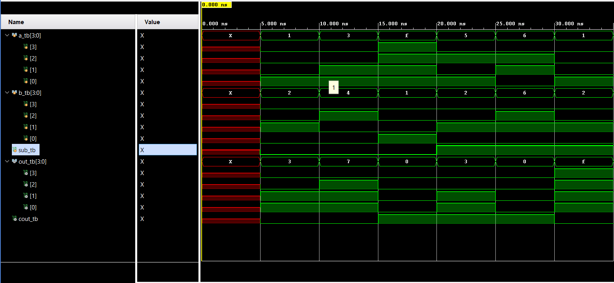

# Adder-Subtractor Project

This project implements a 4-bit adder and subtractor using Verilog.

## Project Structure

- `src/` : Verilog source code and testbench files
- `constraints/` : FPGA constraint files (`.xdc`)
- `images/` : Simulation waveform screenshots
- `sim/` : Simulation configuration files (e.g., waveform `.wcfg`)
- `adder_sub.xpr` : Vivado project file

## Simulation Result

Below is the waveform image showing the simulation output:

## How to Open

Open the `project_2adder_sub.xpr` file in Vivado to load the complete project setup.

## How to Simulate

1. Run behavioral simulation in Vivado.
2. Load the waveform configuration file from `sim/waveform.wcfg` (if included).
3. Observe the simulation output in the waveform window.

